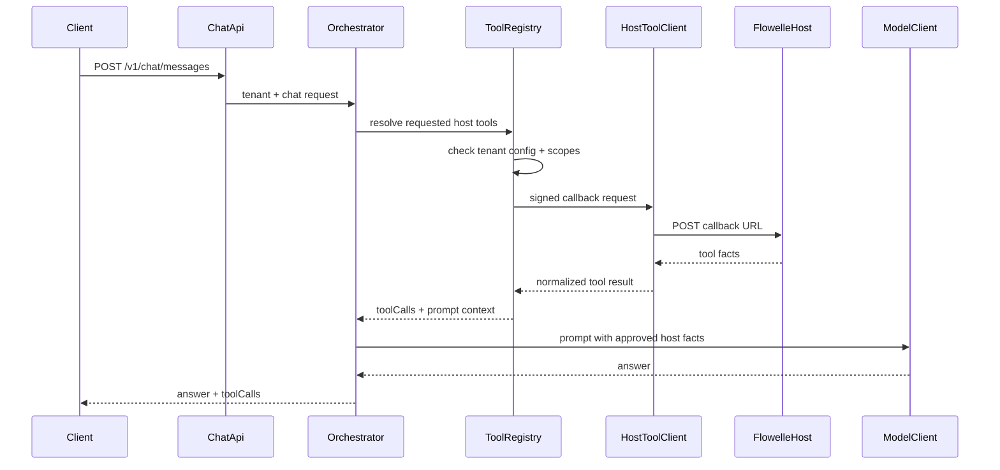

# Host Tool Callback Plan

## Scope

Build the first real host-tool layer behind the existing placeholder in `src/main/java/com/example/demo/service/ToolRegistryService.java`. This slice should support Flowelle-style facts such as cycle summary and user wellness preferences, but it should not implement full Flowelle, RAG, pgvector, or production migrations yet.

## Target Flow



## Implementation Plan

1. Add tenant tool configuration

Create a JPA model and repository for configured host tools:

- `src/main/java/com/example/demo/model/TenantToolConfig.java`
- `src/main/java/com/example/demo/repository/TenantToolConfigRepository.java`

Fields should include tenant, tool name, callback URL, signing secret hash or encrypted placeholder, allowed scopes, active flag, created timestamp. For this slice, store allowed scopes as a simple normalized string or element collection, whichever is cleaner with current JPA style.

2. Add callback contracts

Add DTOs under `src/main/java/com/example/demo/dto`:

- `HostToolRequest`: request id, tenant slug, external user id, session id, tool name, requested scopes, locale, minimal parameters.
- `HostToolResponse`: tool name, status, summary, structured facts map, safe user-facing explanation.
- Keep `ToolCallResponse` as the public API shape, but extend it only if needed to show status and summary without exposing raw facts.

3. Add signing and HTTP client layer

Create:

- `src/main/java/com/example/demo/service/HostToolClient.java`
- `src/main/java/com/example/demo/security/HostToolSigner.java`

Use HMAC-SHA256 over timestamp + request body. Send headers such as `X-AIF-Tenant`, `X-AIF-Timestamp`, `X-AIF-Signature`, and `X-AIF-Request-Id`. Add short timeout settings through `AiFriendProperties`.

4. Replace the placeholder `ToolRegistryService`

Change the service from message-only planning:

```java
public List<ToolCallResponse> plannedToolCalls(String message) {
    return List.of();
}
```

Into tenant/request-aware resolution and invocation:

- Detect simple intents with deterministic rules for this slice: next period, cycle length, wellness preferences.
- Check `request.scopes()` against tenant tool config scopes.
- Call only active, authorized tools.
- Return both public `ToolCallResponse` entries and internal prompt context.
- On unavailable tools, timeout, denied scope, or bad host response, return a failed/skipped tool call and continue safely.

A small internal record such as `ToolExecutionResult` can carry `toolCalls` plus `promptContext` without exposing raw host data in the public response.

5. Inject approved tool facts into model prompts

Update `src/main/java/com/example/demo/service/ChatOrchestratorService.java`:

- Resolve tool results after safety evaluation for non-red-flag messages.
- Add only approved summaries/facts into the system prompt context.
- Preserve the existing wellness-only system prompt and model fallback behavior.
- Record audit metadata with tool names, statuses, and counts, not raw callback payloads.

6. Seed local demo tool configs

Extend `src/main/java/com/example/demo/security/DemoTenantSeeder.java` to optionally seed disabled or mock callback configs for local development. Add env-backed properties for callback base URL and signing secret only if needed for local manual testing.

7. Add focused tests

Add backend tests for:

- Intent detection requests the expected tool.
- Missing scope skips the tool and returns a safe `ToolCallResponse`.
- Authorized scope signs and sends callback request.
- Host timeout/failure returns a failed tool call and still produces safe model prompt.
- Tool facts are included in the model prompt as summarized context.
- Audit events include tool metadata but not raw health data.

Use `MockRestServiceServer` or a mocked `HostToolClient` for service tests. Avoid requiring a real Flowelle service.

8. Documentation

Update `README.md` with:

- Host-tool callback purpose.
- Signing headers.
- Local demo/mock behavior.
- Scope requirements.

Add or update a plan doc such as `plan/milestone2-host-tools.md` if durable planning notes are needed separate from README.

## Non-Goals

- Do not implement full Flowelle.
- Do not store raw menstrual/cycle/symptom data in AI-Friend.
- Do not add pgvector/RAG in this slice.
- Do not introduce browser-side trust; the React app remains a demo client.
- Do not build production tenant-admin screens yet.

## Verification

Run:

```bash
./mvnw test
cd chat-frontend && CI=true npm test -- --watchAll=false
```

Manual smoke test after implementation:

- Start backend and frontend.
- Send "When is my next period?" with a scope that allows cycle summary.
- Confirm response includes a tool call status.
- Send the same prompt without the required scope.
- Confirm the tool is skipped and no raw host data appears in logs.
