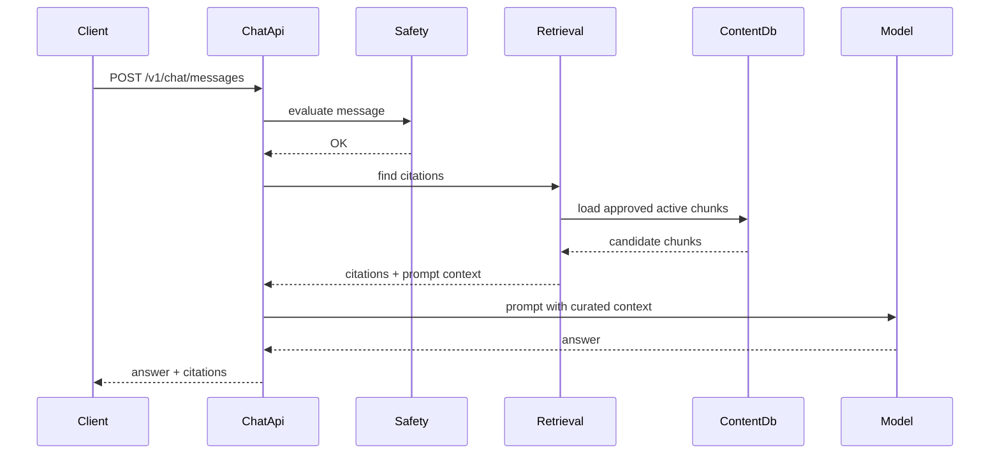

# Milestone 4 Retrieval Foundation

## Summary

Milestone 4 adds a production-oriented persistence and retrieval foundation. AI-Friend now uses Flyway migrations for schema ownership and has a first-pass curated wellness retrieval path that returns citations and injects reviewed context into model prompts.

This is intentionally not pgvector yet. The current retriever is deterministic keyword matching over reviewed content chunks so the behavior is easy to test and reason about.

## Implemented Scope

- Added Flyway as the migration runner.
- Added baseline platform schema migration:
  - tenants
  - API keys
  - chat sessions
  - chat messages
  - audit events
  - tenant tool configs
  - tenant tool scopes
- Added curated content schema:
  - `content_sources`
  - `content_chunks`
- Seeded a small reviewed wellness content set for:
  - menstrual cramps,
  - PMS nutrition and hydration,
  - gentle period/PMS exercise,
  - red-flag symptom routing.
- Added `ContentSource` and `ContentChunk` entities.
- Added content repositories.
- Replaced the no-op `RetrievalService` with keyword-based retrieval.
- Added retrieval configuration:
  - `aif.retrieval.enabled`
  - `aif.retrieval.max-citations`
  - `aif.retrieval.min-query-length`
- Updated chat prompt construction to include curated citation context when relevant.
- Preserved safety behavior: red-flag prompts still bypass retrieval/model generation.

## Data Flow



## Current Retrieval Behavior

The retriever:

- normalizes user message terms,
- removes short/common stop words,
- compares terms against approved chunk topic, keywords, and text,
- ranks chunks by simple match count,
- returns at most `aif.retrieval.max-citations`.

Only active, approved chunks from active, approved sources are eligible.

## Limitations

- No embeddings yet.
- No pgvector yet.
- No content admin/review UI yet.
- Seeded sources use placeholder educational URLs and should be replaced with reviewed production content.
- Keyword retrieval may miss semantically related phrasing.

## Future Work

- Add pgvector-backed embeddings.
- Add content ingestion/review workflow.
- Add locale-specific retrieval.
- Add clinician-reviewed source metadata.
- Add evals for citation relevance.

## Verification

Automated tests added:

- Flyway-backed Spring context starts with H2.
- PMS nutrition prompts return citations.
- Unrelated prompts return no citations.
- Prompt context includes bounded source text.
- Chat API responses include citations.
- Citation prompt context is sent to the model.
- Red-flag prompts still bypass model generation and return no citations.

Commands:

```bash
./mvnw test
cd chat-frontend && CI=true npm test -- --watchAll=false
```
