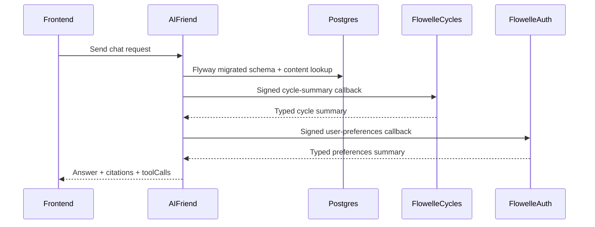

# Milestone 5: Production Test and Integration Hardening

## Scope

Milestone 5 hardens the current AI-Friend + Flowelle foundation before adding pgvector. It focuses on test confidence and integration correctness across both workspace repos:

- [`/Users/abhijitmohanty/Documents/Pers-Projects/AI-Friend`](/Users/abhijitmohanty/Documents/Pers-Projects/AI-Friend)
- [`/Users/abhijitmohanty/Documents/Pers-Projects/Flowelle`](/Users/abhijitmohanty/Documents/Pers-Projects/Flowelle)

The plan file should also be copied into AI-Friend's project plan folder as [`plan/milestone5-integration-hardening.md`](/Users/abhijitmohanty/Documents/Pers-Projects/AI-Friend/plan/milestone5-integration-hardening.md) during implementation.

## Current Baseline

AI-Friend has:

- Flyway migrations and curated retrieval.
- Signed host-tool callback client.
- Typed Flowelle adapter.
- Backend tests passing with H2.
- Frontend smoke tests, but no UI for citations/tool calls.

Flowelle has:

- `cycles-service` AIF endpoint: `/api/aif/tools/cycle-summary`.
- `auth-service` AIF endpoint: `/api/aif/tools/user-preferences`.
- HMAC verifier and `X-AIF-Key-Id` support.
- Service-local controller/security tests.

## Target Flow



## Implementation Plan

1. Add durable milestone plan file

Create [`plan/milestone5-integration-hardening.md`](/Users/abhijitmohanty/Documents/Pers-Projects/AI-Friend/plan/milestone5-integration-hardening.md) in AI-Friend with this plan content. Do not edit the Cursor plan file.

2. Add AI-Friend PostgreSQL migration tests

In AI-Friend:

- Add Testcontainers dependencies to [`pom.xml`](/Users/abhijitmohanty/Documents/Pers-Projects/AI-Friend/pom.xml).
- Add a test such as `PostgresMigrationIntegrationTest` that starts a PostgreSQL container and runs the Spring context/Flyway migrations against it.
- Assert key tables exist, including `tenants`, `tenant_tool_configs`, `content_sources`, and `content_chunks`.
- Keep existing H2 tests intact.

3. Add shared JSON contract fixtures

Create stable contract fixtures in AI-Friend, likely under:

- [`src/test/resources/contracts/flowelle/cycle-summary-request.json`](/Users/abhijitmohanty/Documents/Pers-Projects/AI-Friend/src/test/resources/contracts/flowelle/cycle-summary-request.json)
- [`src/test/resources/contracts/flowelle/cycle-summary-response.json`](/Users/abhijitmohanty/Documents/Pers-Projects/AI-Friend/src/test/resources/contracts/flowelle/cycle-summary-response.json)
- [`src/test/resources/contracts/flowelle/user-preferences-request.json`](/Users/abhijitmohanty/Documents/Pers-Projects/AI-Friend/src/test/resources/contracts/flowelle/user-preferences-request.json)
- [`src/test/resources/contracts/flowelle/user-preferences-response.json`](/Users/abhijitmohanty/Documents/Pers-Projects/AI-Friend/src/test/resources/contracts/flowelle/user-preferences-response.json)

Mirror or copy equivalent fixtures into Flowelle service test resources:

- `backend/cycles-service/src/test/resources/contracts/aif/...`
- `backend/auth-service/src/test/resources/contracts/aif/...`

Use the same field names, statuses, scopes, and signing headers across both repos.

4. Add AI-Friend contract fixture tests

In AI-Friend:

- Verify `FlowelleToolClient` can parse the response fixtures.
- Verify generated `HostToolRequest` parameters match the request fixture shape.
- Verify `RestTemplateHostToolClient` signs the exact JSON body with the known HMAC vector.
- Add behavior for Flowelle `NO_DATA`: AI-Friend should preserve a safe non-completed tool response instead of treating it as a malformed contract.

5. Add Flowelle contract fixture tests

In Flowelle:

- Update `cycles-service` tests to load the cycle-summary request fixture and verify the response shape.
- Update `auth-service` tests to load the user-preferences request fixture and verify the response shape.
- Add signature tests using the shared known vector.
- Add negative tests for request ID mismatch, tenant mismatch, missing scope, expired timestamp, and invalid signature.

6. Add AI-Friend integration smoke with stubbed Flowelle HTTP

In AI-Friend:

- Add a Spring integration test that uses `MockRestServiceServer` or a local stub HTTP server for both Flowelle callback URLs.
- Seed two `TenantToolConfig` rows with distinct URLs:
  - cycle-summary URL
  - user-preferences URL
- Send one chat request that triggers both food/exercise + cycle context if possible, or two requests if intent separation is clearer.
- Assert:
  - callbacks are signed,
  - AI-Friend receives `COMPLETED` tool calls,
  - citations still appear when relevant,
  - red-flag prompts skip retrieval/model/tool calls.

7. Improve React demo visibility

In AI-Friend frontend:

- Store AI responses as structured objects, not only `{ text, sender }`.
- Render citations under AI messages when present.
- Render tool call status under AI messages when present.
- Keep UI minimal and demo-oriented.
- Add tests for citations/tool call display.

Relevant files:

- [`chat-frontend/src/App.js`](/Users/abhijitmohanty/Documents/Pers-Projects/AI-Friend/chat-frontend/src/App.js)
- [`chat-frontend/src/App.test.js`](/Users/abhijitmohanty/Documents/Pers-Projects/AI-Friend/chat-frontend/src/App.test.js)

8. Documentation updates

Update AI-Friend docs:

- [`README.md`](/Users/abhijitmohanty/Documents/Pers-Projects/AI-Friend/README.md)
- [`plan/milestone5-integration-hardening.md`](/Users/abhijitmohanty/Documents/Pers-Projects/AI-Friend/plan/milestone5-integration-hardening.md)

Document:

- Testcontainers PostgreSQL requirement.
- Shared contract fixture location.
- Manual local callback wiring for Flowelle `8081` and `8082`.
- Frontend citation/tool call demo behavior.

## Non-Goals

- Do not add pgvector in this milestone.
- Do not add production secret management yet.
- Do not build a tenant admin UI.
- Do not add a full API gateway.
- Do not require live Flowelle services for AI-Friend CI tests.

## Verification

Run in AI-Friend:

```bash
./mvnw test
cd chat-frontend && CI=true npm test -- --watchAll=false
```

Run in Flowelle:

```bash
cd backend/cycles-service && ./mvnw test
cd ../auth-service && mvn test
```

If Docker/Testcontainers is unavailable, mark the PostgreSQL migration test as skipped by environment assumption rather than weakening the rest of the suite.
